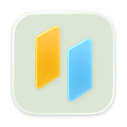
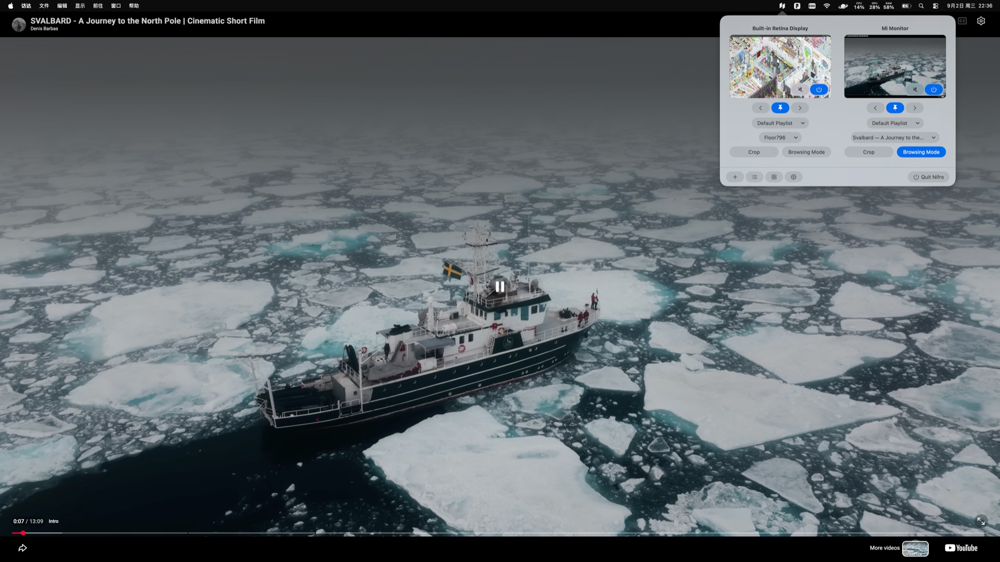
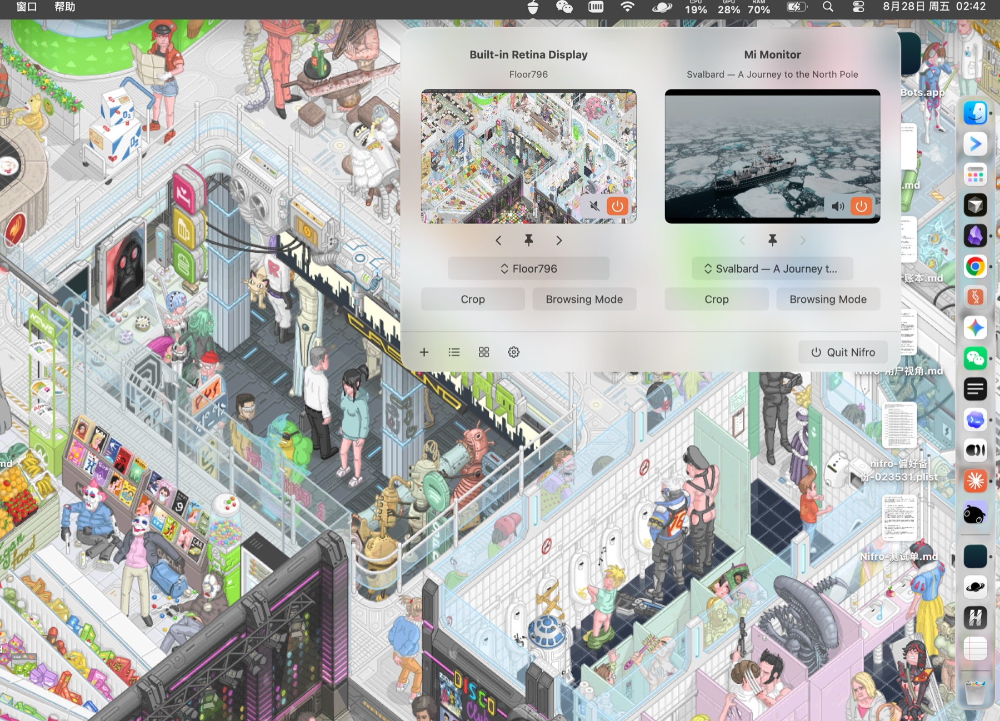

<p align="center">
  
</p>

<h1 align="center">Nifro</h1>

<p align="center">
  <b>A live window to somewhere else, behind your work.</b><br>
  Make any website your Mac desktop wallpaper: a nature film, a live camera, a map, a dashboard, or a shader.<br>
  Anything a browser can draw, drawn behind your windows.
</p>

<p align="center">
  <a href="https://github.com/PathGao/Nifro/releases/latest"></a>
  <a href="https://github.com/PathGao/Nifro/actions/workflows/ci.yml"></a>
  <a href="license"></a>
  <a href="#install"></a>
</p>

<p align="center">
  <a href="https://github.com/PathGao/Nifro/releases/latest/download/Nifro-arm64.dmg"></a>
  <a href="https://github.com/PathGao/Nifro/releases/latest/download/Nifro-x86_64.dmg"></a>
</p>

<p align="center">
  <a href="https://github.com/PathGao/Nifro/releases">Releases</a>
  ·
  <a href="sites/">Adding a site</a>
  ·
  <a href="sites/CANDIDATES.md">Candidate sites</a>
  ·
  <a href="docs/ROADMAP.md">Roadmap</a>
  ·
  <a href="CONTRIBUTING.md">Contributing</a>
  ·
  <a href="README.zh-Hans.md">简体中文</a>
</p>

<p align="center">
  
</p>

---

## Install

```sh
brew tap PathGao/tap https://github.com/PathGao/Nifro
brew trust --cask PathGao/tap/nifro
brew install --cask nifro
```

> [!NOTE]
> Homebrew will not load a cask from outside its own repositories until you say you trust it, because
> a cask can run code after installing. This one runs a single command — it clears the "downloaded
> from the internet" mark macOS puts on the app, which is what lets it open without being turned
> away. Read the whole thing in [Casks/nifro.rb](Casks/nifro.rb) before you trust it.
>
> Plain `brew install --cask nifro`, with no tap and nothing to trust, needs Nifro to be in
> Homebrew's own cask repository, which has a popularity threshold this project has not reached.

### Or download a disk image

| Chip | Download | |
|---|---|---|
| **Apple silicon** | [`Nifro-arm64.dmg`](https://github.com/PathGao/Nifro/releases/latest/download/Nifro-arm64.dmg) | M1 and later |
| **Intel** | [`Nifro-x86_64.dmg`](https://github.com/PathGao/Nifro/releases/latest/download/Nifro-x86_64.dmg) | |

There is no universal binary, so nobody downloads the half they cannot run. Both links always point
at the newest build.

> [!IMPORTANT]
> **The first launch will be refused.** Builds are signed with the project's own certificate rather
> than an Apple Developer ID one, so they are not notarized, and macOS answers a downloaded copy with
> *"Apple could not verify Nifro is free of malware"* — a dialog offering only **Move to Trash** and
> **Cancel**. Neither is the way through. It is:
>
> 1. Press **Cancel**. Not Move to Trash.
> 2. Open **System Settings → Privacy & Security** and scroll to the bottom.
> 3. Press **Open Anyway** on the line naming Nifro, and confirm with your password or Touch ID.
> 4. Press **Open** in the last dialog.
>
> Once, for good — macOS remembers. Control-click → Open, which used to be the shortcut, no longer
> works: Apple removed that route in macOS 15. Installing with brew skips all of it, which is what
> makes brew the recommended one. See [docs/RELEASE.md](docs/RELEASE.md).

Requires macOS 15 or later.

### Uninstalling

```sh
brew uninstall --zap --cask nifro
```

Dragging the app to the Trash leaves its container behind. That is macOS, not Nifro — a container
outlives the app that owned it, and no app is given a chance to run at uninstall. `--zap` is the flag
that removes it; without it, or if the app was installed from the disk image, delete these by hand:

```
~/Library/Containers/com.pathgao.nifro
~/Library/Containers/com.pathgao.nifro.ShareExtension
~/Library/Application Scripts/com.pathgao.nifro
~/Library/Application Scripts/com.pathgao.nifro.ShareExtension
```

What is in there is mostly WebKit's, not yours, and Nifro keeps it under 100 MB while it runs — see
[`DiskBudget`](Nifro/Support/DiskBudget.swift). **Settings → Advanced → Clear all website data**
empties it on demand.

## Where this came from

Inspired by [Plash](https://github.com/sindresorhus/Plash) by Sindre Sorhus.

Nifro starts with the same idea: use a web page as your desktop wallpaper. Everything around that idea
has been rebuilt.

The interface makes the relationship between websites, playlists and displays easy to see and control.
Each display has its own wallpaper, controls and state. You can crop a page to the part that belongs on
your desktop, and manage sites as playlists instead of a flat list.

Performance and day-to-day use are part of that redesign too. The idea remains; nearly every part of
the app that delivers it has been rebuilt.

## What it does

**Put a web page on your desktop.** Use a live camera, an art site, a map, a dashboard or any other
page that works better in the background than in another browser tab.

**Give every display its own page.** On a multi-display Mac, each screen can show something different.
The menu-bar panel puts every display side by side, with its current page and only its own controls.

**Show only the useful part of a page.** Drag, scroll or zoom to frame the region you want. Nifro
remembers that region and keeps the same place in view when you move it to a display of another size.

**Organize sites as playlists.** Make playlists for work, scenery or anything else, then let a display
stay on one site, move through them in order or at random, or follow each site's schedule.

<p align="center">
  
</p>

**Use a page when you need to.** Hold a key to click, scroll and zoom it; let go and it becomes a
wallpaper again. Sound and link behaviour are remembered for each website.

**Start from a gallery or make your own.** The built-in gallery has sites selected for desktop use,
and you can add any page yourself. Nifro is available in English and Simplified Chinese.

## Best uses

Nifro works best with pages that are pleasant to leave on screen and still useful when you only glance
at them.

- **Generative art and ambient animation.** [Floor796](https://floor796.com/) and similar art sites
  turn a static desktop into something that keeps changing without demanding attention.
- **Music and long-form video.** A YouTube lofi stream, ambient music or HDR landscape video can sit
  behind your work, while sound stays under per-website control.
- **Live scenery.** Window views, nature cameras and [WindowSwap](https://www.window-swap.com/) make
  a calm background that keeps changing throughout the day.
- **Work and world dashboards.** OpenAI or Claude usage pages, and live dashboards such as
  [World Monitor](https://www.worldmonitor.app/), make information you check repeatedly available at
  a glance.
- **Live maps.** [Windy](https://www.windy.com/) and [Flightradar24](https://www.flightradar24.com/)
  are useful when weather or flight activity is worth keeping in view.

## Build from source

### Requirements

- macOS 15 or later
- Xcode 26 or later

### Open and run in Xcode

```sh
git clone https://github.com/PathGao/Nifro.git
cd Nifro
open Nifro.xcodeproj
```

In Xcode, select the `Nifro` scheme and **My Mac**, then press **Run** (⌘R).

### Build a local test copy

```sh
./Tools/build-local.sh
```

The script creates the local signing identity when needed, builds with the app's sandbox entitlement,
and installs `Nifro-test.app` on the Desktop. Use it instead of re-signing an Xcode build by hand:
re-signing an already signed bundle can remove its entitlements and make it use a different preferences
container from the released app.

### Run tests

```sh
swift test
```

The suite covers both app behaviour and project guardrails: display-specific state, playlist migration,
crop and zoom behaviour, URL handling, settings compatibility, and source-level rules that types alone
cannot enforce.

## Contributing

Start with [CONTRIBUTING.md](CONTRIBUTING.md). The lowest-effort useful contribution is a site
entry. If you have a page that works well as a wallpaper, that is worth more to this project than
most code.

## License

MIT. See [license](license). The app icon and other artwork are original to this project.
