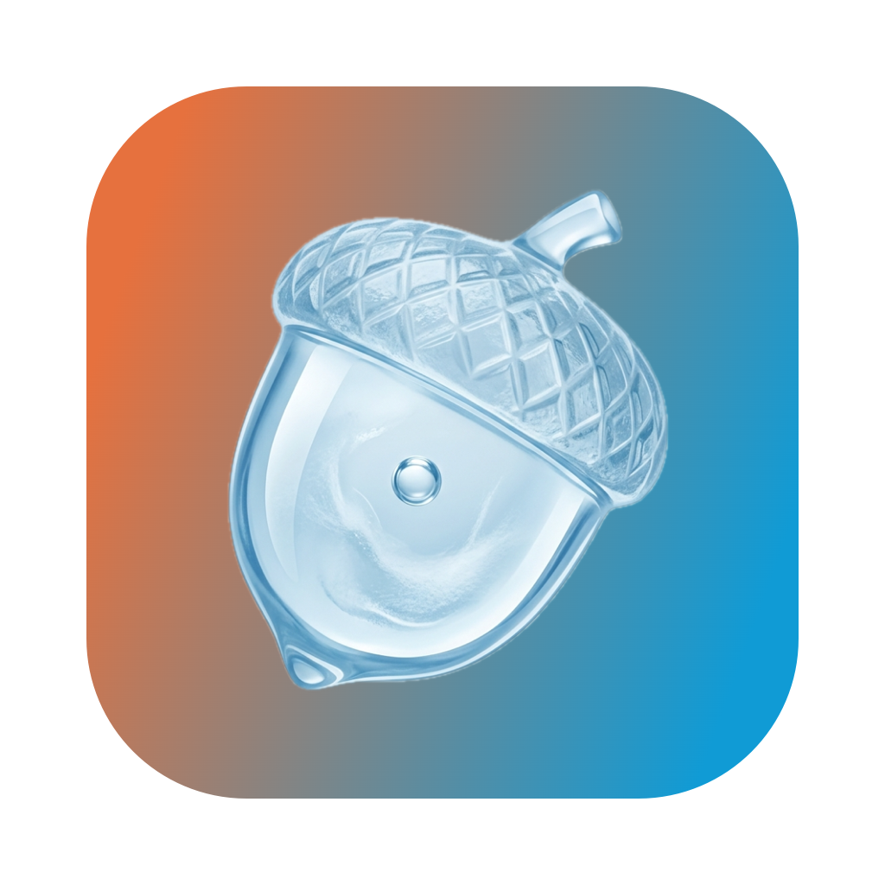

<p align="center">
  
</p>

<h1 align="center">Nifro</h1>

<p align="center">
  <b>把任意网页变成你的 Mac 桌面壁纸。</b><br>
  一个时钟、你的日历、一块仪表盘、一张实时地图、一段着色器、一个自然摄像头。<br>
  浏览器能画出来的东西，都可以画在你的窗口后面。
</p>

<p align="center">
  <a href="https://github.com/PathGao/Nifro/releases/latest"></a>
  <a href="license"></a>
  
  
</p>

<p align="center">
  <a href="https://github.com/PathGao/Nifro/releases/latest"><b>下载</b></a>
  ·
  <a href="sites/">站点清单</a>
  ·
  <a href="docs/ROADMAP.md">路线图</a>
  ·
  <a href="CONTRIBUTING.md">参与贡献</a>
  ·
  <a href="README.md">English</a>
</p>

---

## 安装

```sh
brew tap PathGao/tap https://github.com/PathGao/Nifro
brew install --cask nifro
```

或者[下载最新版本](https://github.com/PathGao/Nifro/releases/latest) —— Apple silicon 取
`arm64`，Intel 取 `x86_64`。不做通用二进制，免得每个人都下载一份自己永远用不到的另一半。

推荐用 Homebrew。构建包用的是本项目自己的证书而不是 Apple Developer ID，好处是签名身份跨版本
不变，代价是没有经过 Apple 公证 —— 直接下载的包首次打开会被门禁拦下，需要去「系统设置 → 隐私与
安全性」放行一次。用 cask 安装则这一步已经替你做了。详见 [docs/RELEASE.md](docs/RELEASE.md)。

需要 macOS 15 或更高版本。

## 这个项目从哪来

Nifro 是 Sindre Sorhus 的 [Plash](https://github.com/sindresorhus/Plash) 的开源分支，取自它在
2025 年 10 月闭源之前最后一个 MIT 许可的快照。Plash 本身仍在开发、仍在 App Store 上；想要原版
请[去那里拿](https://sindresorhus.com/plash)。Nifro 不是它，也不自称是它，没有使用它的任何品牌
或美术资源。

做这个分支有两个原因。一是那个项目五年的 issue 列表里堆着很多合理的请求，而它们需要的改动是原
项目不打算接的。二是把代码读完之后会发现，它建立在两个值得重新考虑的前提上：

- 为了显示一分钟才变一次的内容，它让浏览器一直在渲染。
- 它其实不是壁纸，而是压在壁纸上方的一个透明窗口。

这个分支要做的就是拆掉这两条。计划见 [docs/ROADMAP.md](docs/ROADMAP.md)，上游每一条未关闭
issue 的分诊见 [docs/UPSTREAM-ISSUES.md](docs/UPSTREAM-ISSUES.md)。

## 它比 Plash 多做了什么

**只渲染你看得见的部分。** 壁纸窗口铺满整个屏幕，所以你每开一个最大化窗口，页面仍然在下面一帧
一帧地画。Nifro 会算出壁纸实际还露出多少，把窗口缩到那一块只渲染那一块；什么都看不见时就停在
最后一帧。最常见的情况 —— 只剩程序坞后面那一条 —— 恰恰是系统自己的遮挡状态永远不会报告为
「已隐藏」的。

**自己判断一个页面到底需不需要渲染。** 大多数被当成壁纸的页面是文档、地图和仪表盘：加载、稳定，
然后就是一张图。Nifro 会先观察页面一分钟到底在做什么，如果什么都不动，就改成按计划加载、拍照、
关掉，而不是让浏览器开一整天。页面要是开始动了，它会改回来。

**放大网页的一部分。** 在壁纸上拖一个框，那一部分就铺满屏幕，导航栏、边框和四周的留白都没了。
页面仍然按整屏排版，所以站点不会重排成你没框过的样子；那一块是重新渲染出来的而不是拉大的，
所以字仍然是清楚的。框锁定成你屏幕的形状，而且记下来的是「位置 + 倍率」而不是矩形，所以同一个
网站用同样的缩放换到形状不同的另一块屏上照样成立。

**一块屏一个页面。** 把网站指派给某块屏幕，每块屏各显示各的。

**带时段的轮播。** 让一块屏在几个网站之间轮换，也可以让某个网站声明自己什么时间段才允许出现。
排班永远不会把一块屏清空。

**按住某个键就能操作页面。** 按住时可以点击、滚动、缩放，松开就变回壁纸。

**声音按网站分别记住。** 时钟永远不该出声，而直播没有声音就没意义。

**一份经过挑选的站点清单。** [`sites/`](sites/) 收录了适合当壁纸的网页，每条都带着让它好用的
那些设置。添加一条只需要一个 YAML 文件，不用写 Swift，也不用开 Xcode。App 内的图库直接读这个
分支上的清单，所以合并进来的条目不用等发版就能看到。

**全应用中英双语。**

## 从源码构建

```sh
git clone https://github.com/PathGao/Nifro
cd Nifro
open Nifro.xcodeproj
```

需要 Xcode 26 或更高版本。Swift 6 语言模式，部署目标 macOS 15。

`./Tools/build-local.sh` 会构建并安装一份测试包，签名方式和发布版一致。请用它，不要自己手动
签名：Xcode 已经签过之后再签一次会覆盖掉原签名，连沙盒 entitlement 一起丢掉，而一个没有沙盒的
Nifro 读的偏好文件和真实安装的不是同一份。

裁剪、遮挡、排班、视频嵌入和活动分类这几块纯逻辑有测试，不需要 app 包，也不需要窗口服务器：

```sh
swift test
```

## 目录结构

```
Nifro/
├── App/          入口、状态、事件、菜单、快捷指令
├── Wallpaper/    窗口、web view、加载、快照
├── Visibility/   渲染多少，以及什么时候停
├── Zoom/         缩放、拖框选取的浮层、网站级设置
├── Sites/        网站模型与站点清单
├── Screens/      SwiftUI 窗口与设置界面
└── Support/      几何、排班与共用扩展
```

## 参与贡献

先看 [CONTRIBUTING.md](CONTRIBUTING.md)。最省力又最有用的贡献是加一条站点。如果你有一个当壁纸
很好看的页面，那对这个项目的价值超过大部分代码。

## 许可

MIT，见 [license](license)。衍生自 [sindresorhus/Plash](https://github.com/sindresorhus/Plash)
v2.16.0，版权归 Sindre Sorhus，以同一许可使用。应用图标及其他美术资源不衍生自 Plash。
